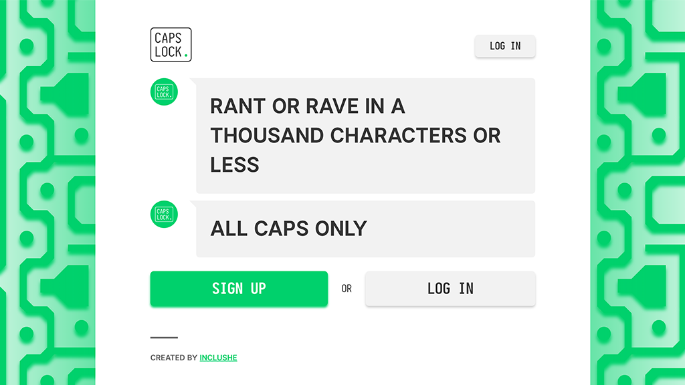

# CAPS LOCK



RANT OR RAVE IN A THOUSAND CHARACTERS OR LESS

## Installation

- Use Node version 12.22.7.
- Copy vars.env.example to vars.env.
- Set up postgresql and add DB_USER and DB_PASS to vars.env.
- Get keys from [Mailtrap](https://mailtrap.io/) for development or [SendGrid](https://sendgrid.com/) for production.
- Generate SESSION_SECRET with `openssl rand -hex 512` and add to vars.env.

Postgres & Node
```bash
git clone
nvm install 12.22.7
nvm use 12.22.7
npm i
heroku create
git push heroku master
heroku addons:create heroku-postgresql:hobby-dev
heroku config:set SESSION_SECRET=$(openssl rand -hex 512)
heroku config:set SENDGRID_API_KEY=<SENDGRID KEY>
heroku run npm run migrate
```